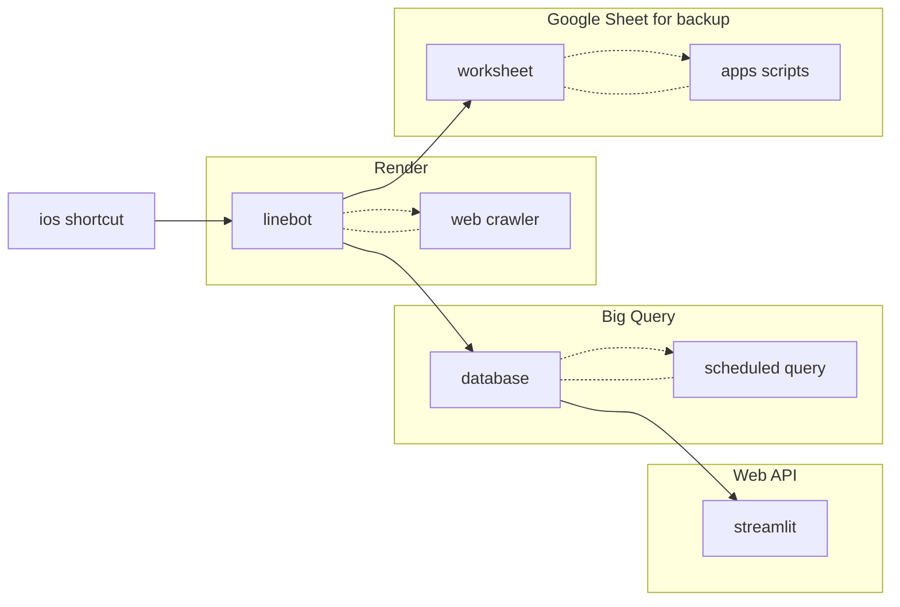

# Sports Betting Freerider

這是一個用來蒐集
[玩運彩網站](https://www.playsport.cc/billboard/mainPrediction?allianceid=3&from=header)
主推榜上前幾名的比賽預測的專案，
透過統計哪些預測結果被最多人下注，
我們可以快速找出獲勝機率較高的預測。

  

## 專案流程圖

## 資料蒐集

### Line 機器人進行爬蟲

我們使用 Line 機器人作為 API 入口，發送爬蟲的請求，相關操作包括:
1. 點擊下方按鈕會出現選單，可快速選擇要以哪一個時間區段的主推榜名單作為爬蟲對象。
    - 如選擇「上月」，則會以上個月主推榜上前30名對隔日比賽結果的預測為目標。
2. 手動輸入指令，格式為 "運動 主推榜時間範圍 爬蟲名次 信箱"。
    - 如輸入 "NBA lastmonth 30 test@gmail.com"，則會爬取 NBA 主推榜上個月前30名的預測結果，並將結果寄到 test@gamil.com 信箱中。
3. 點選右下角按鈕「指令教學」可快速查看指令格式。
    - 也可以直接輸入 "help"。

    

    
    

爬蟲結果會直接寄至使用者信箱，如下圖所示。
1. 第一個表格為只記錄主推榜主推的預測結果。
2. 第二個表格為記錄主推榜所有的預測結果。

    

    
    

### Iphone 捷徑完成自動化爬蟲

本專案的的 Line 機器人是架設在 Render 上的免費方案，這導致:
1. 每個月有 750 小時的使用上限
2. 15 分鐘內沒有人對該機器人發送請求，機器人會自動休眠，下次再有人發送請求時才會需要重新啟動 1 分鐘

此限制有利有弊，利在於我們不需要隨時讓伺服器保持運作而浪費資源，弊在於操作上會有些不方便。
有鑒於此，與其使用 Render 上的定期排程，不如直接使用 Iphone 捷徑來完成定期自動化爬蟲，如下圖。

    
    

## 資料儲存

### Big Query 作為資料庫以及自動化處理

本專案將爬蟲的結果儲存至 Big Query 的 database，主要儲存三種 table:

1. 玩家預測表: total, mainpush
2. 比賽結果表: result
3. 結合表: total_result, mainpush_result

第三種表是每天定期將前兩種表的內容整合 (`left_join`) 並且進行更新 (append)，方便快速查閱資料。

### Google Sheet 作為資料庫(舊版)

將爬蟲結果直接從信箱讀取固然方便，但是不利於記錄與後續的分析，
因此本專案又建立了一個 Google Sheet 表單作為資料庫，將爬蟲結果存放在此。

有了這個資料庫，我們可以進行後續的資料分析，如統計長期的勝率:

又或者是計算長期的累積勝率變化:

### Google Apps Script 進行自動化資料處理(舊版)

原先對 Google Sheet 進行資料處理都是使用內建的函示如 `Match()`, `ArrayFormula()` 等，
但是這些都會使表單的運作變得緩慢，因此本專案額外使用 Google Apps Script 來進行自動化資料處理，
將原先的公式寫成 AppScript 程式碼，並且設定每天固定時間自動執行。

## 資料視覺化

### Streamlit 視覺化結果

為了快速對長期的資料有即時全面的掌握，本專案使用 streamlit 架設了一個網站。

其中包含一個簡單的 dashboard，比較當月的爬蟲結果趨勢:

以及能給定條件搜尋出近期的比賽預測與結果:

搜尋內容會先以圓餅圖快速呈現預測準確度，並以表格的方式列出結果：

## 資料分析

由於台灣運彩的賠率是 $1.75$，因此要獲利勝率就必須維持在 $\frac{1}{1.75} \approx 58$% 以上。
目前若使用上個月的主推榜每天最多人選擇的預測結果，則勝率最高為 $62$%，
此專案是否能順利使用尚有待觀察。
